# Introduction

In this project, I am analyzing SF Bay Area Bike Share dataset. To do so, I am using following datasets:

1. Trips Dataset
2. Station Dataset
3. Weather Dataset
4. Yelp Customer Reviews Dataset

Through this analysis, I aim to achieve a better understanding of how different factors affect the bike sharing and how BABS has been performing over the course of time.

Click [here](http://www.bayareabikeshare.com/open-data/) to go to the dataset.

# Technology Stack

1. Hadoop MapReduce
2. HBase
3. Hive
4. Pig
5. Weka
6. Tableau

# Analysis results

Note: All the charts are plotted using Tableau

## Analysis 1: Binning pattern to determine distribution of rides in a day

Using this analysis, I aimed at finding the spread of rides over the hours of the day.

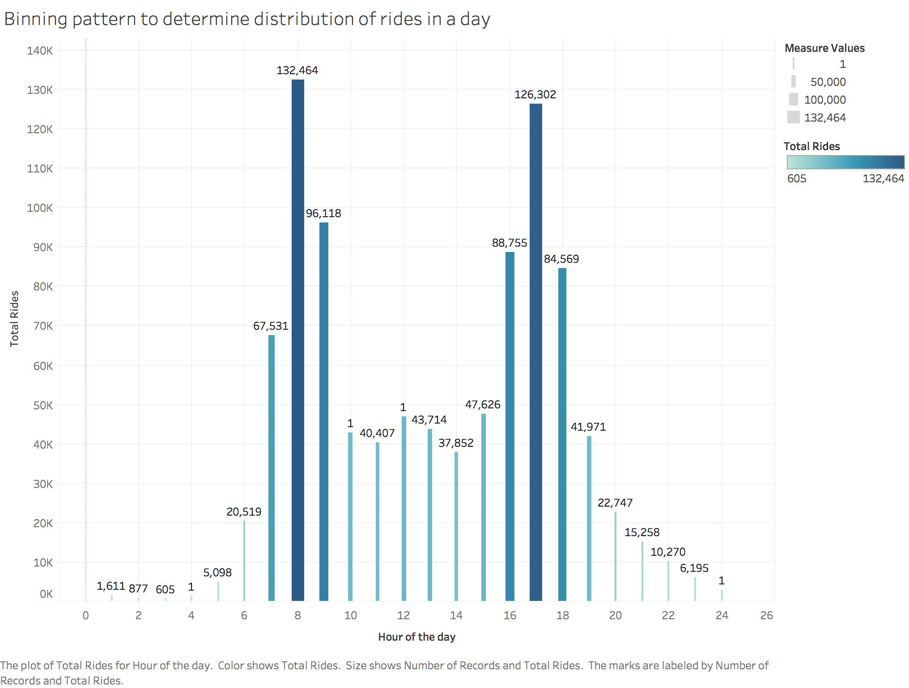

## Analysis 2: Subscriber vs. Customer during each year

In this analysis, I have used custom writable objects to store the running total of the count for each kind of user. The result obtained can be understood from the following tableau chart:

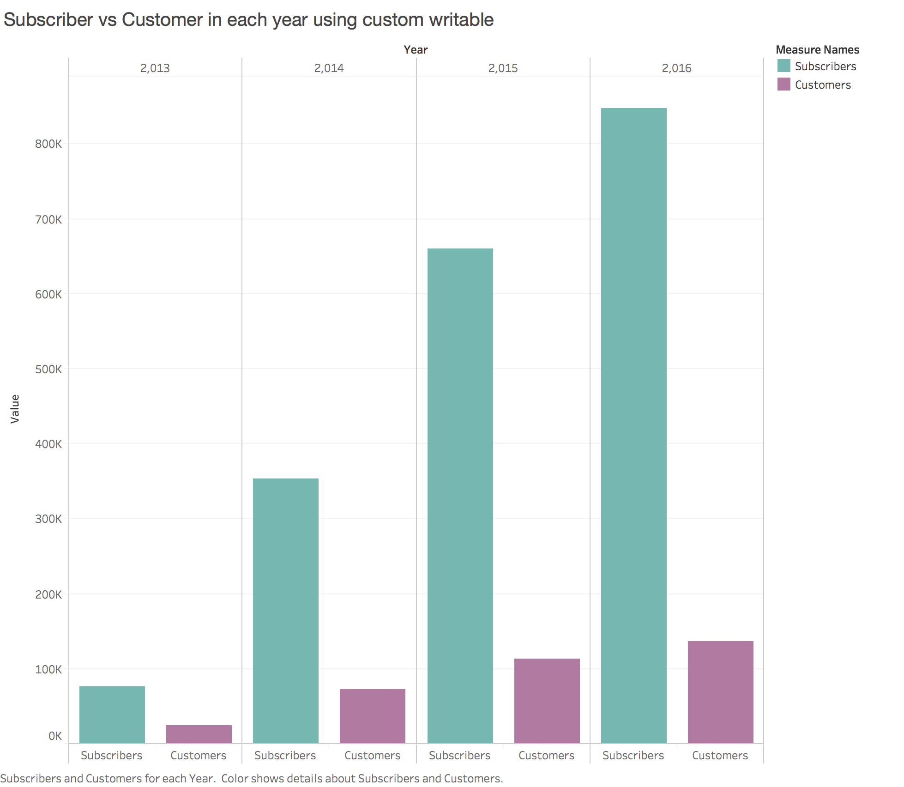

## Analysis 3: Distribution of rides over months

To determine the distribution of rides over the year for each month, I have used counting with counters pattern.

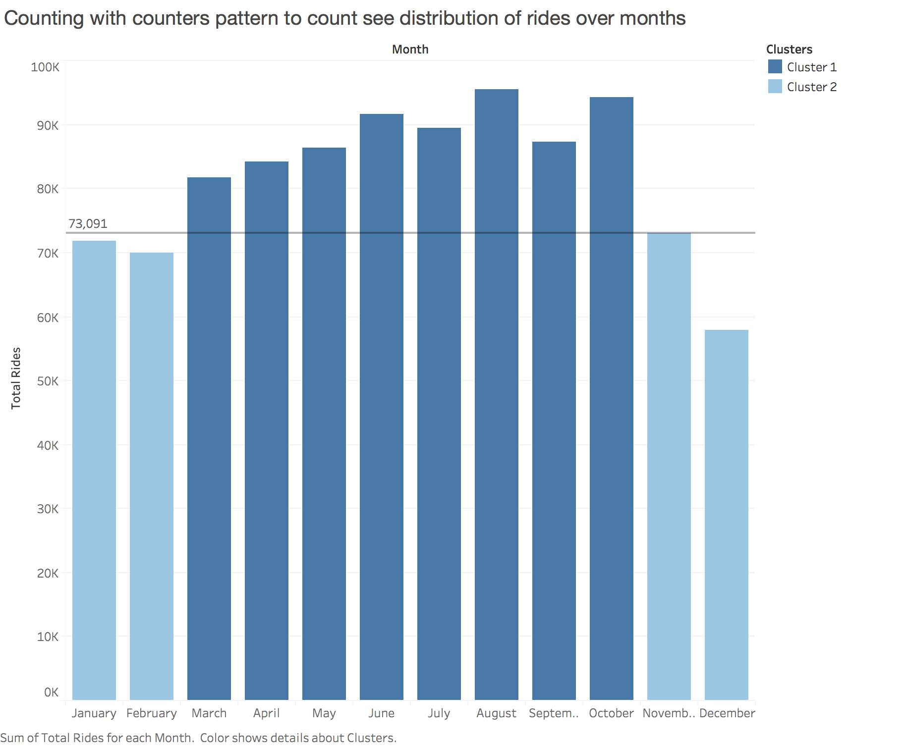

## Analysis 4: Determining Top 6 stations based on the number of rides

Here, we are employing Top K values pattern to determine top 6 most busiest stations in the bay area. These are the stations from where most number of rides start.

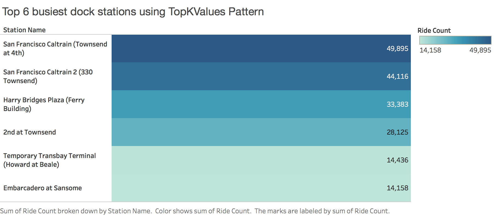

## Analysis 5: Distribution of rides based on temperature

In this analysis, we are determining how the mean temperature of a day affects the turn up of people for bike share. We are making this analysis for top 5 busiest stations.
<br/>
To achieve this, we are join two datasets using inner join. We are also employing secondary sorting, inner join, top k pattern and chaining techniques.

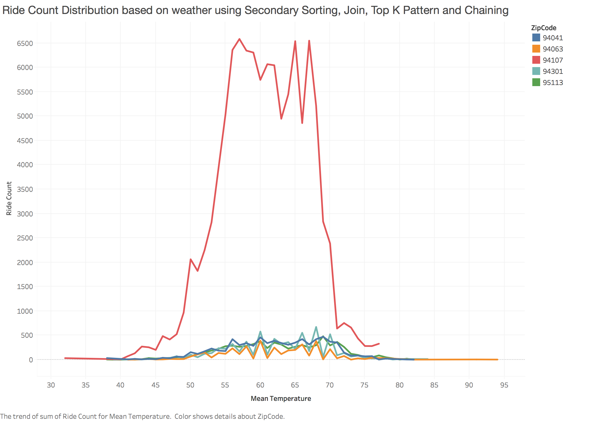

## Analysis 6: Sentiment Analysis of user's yelp reviews

I have used Yelp API to fetch data of customer’s review for BABS service. A very naïve method is used to analyze sentiments of users.

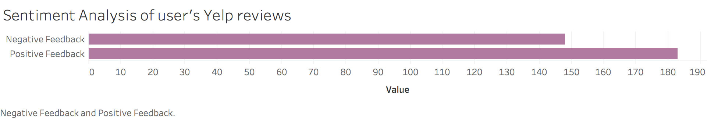

## Analysis 7: Using Pig to find duration of trip for start station, total trips started and average trip duration

I have used Pig in local mode for this analysis.
Following are the commands

1. Start Pig
```

./pig -x local
```

2. Load table data
```
tripdata = LOAD '/Users/mansijain/Desktop/BABS-Dataset/trips/trips.csv' USING PigStorage(',') as (trip_id: int, start_date: chararray, start_station: chararray, start_term: chararray, end_date: chararray, end_station: chararray, end_term: int, bike, zip_code: int);
```

3. Group data by start station column
```
split_station = GROUP tripdata BY start_station;
```

4. Perform aggregate function
```
results = FOREACH split_station GENERATE GROUP AS start_station, SUM(tripdata.duration), AVG(tripdata.duration), count(trip_id);
```

5. Store results in local fs
```
STORE results INTO '/Users/mansijain/Desktop/BABS-Dataset/results/start_stn' USING PigStorage(',');
```

Following chart was obtained:

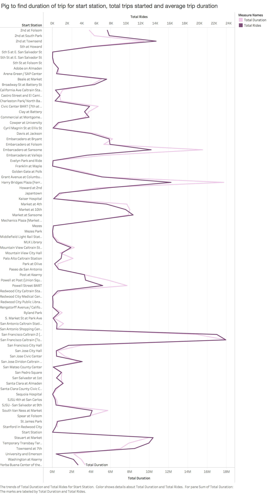

## Analysis 8: Using Pig to find duration of trip for end station, total trips started and average trip duration

A similar pig query is used to determine data associated with the end station.

1. Group data
```
split_station = GROUP tripdata BY end_station;
```
2. Aggregate data
```
results = FOREACH split_station GENERATE GROUP AS end_station, SUM(tripdata.duration), AVG(tripdata.duration), count(trip_id);
```
3. Store data
```
STORE results INTO '/Users/mansijain/Desktop/BABS-Dataset/results/end_stn' USING PigStorage(',');
```

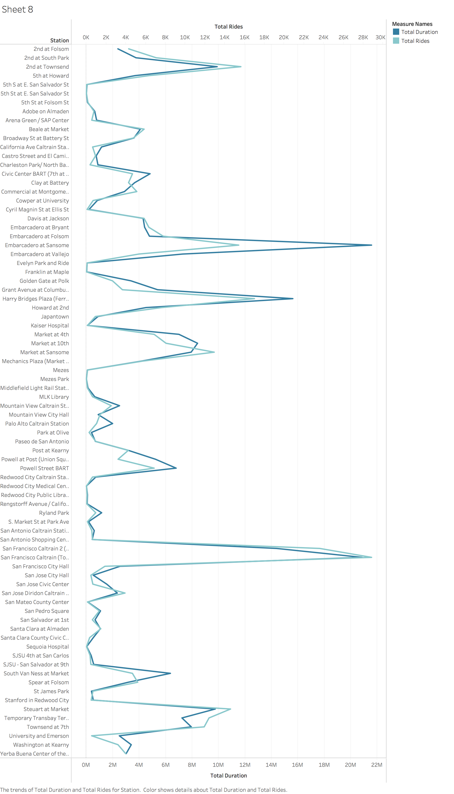

## Analysis 9: Using Hive to analyze total stations and dock counts in all the cities of Bay Area

I have used Hive for this analysis. Following are the steps I followed:

1. Create table
```
CREATE TABLE stationTable (id int, name string, lat double, long double, dock_count int, landmark string, date_inst date) row format delimited fields terminated by ',' STORED AS TEXTFILE;
```
2. show tables
```
show tables;
```
3. Insert vales
```
INSERT OVERWRITE local directory '/Users/mansijain/Desktop/BABS-Dataset/hive' ROW FORMAT DELIMITED FIELDS TERMINATED BY ',' SELECT landmark, count(id), sum(dock_count) FROM stationTable GROUP BY landmark;
```
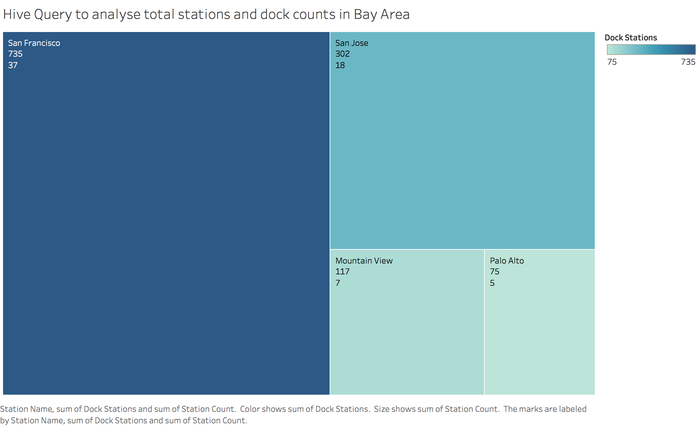

## Analysis 10: Analyze the spread of all the stations in the cities of Bay Area

Using distinct filtering pattern, I analyzed all the stations present in the bay area. I have utilized latitude and longitude column to visually see the locations on a geomap.

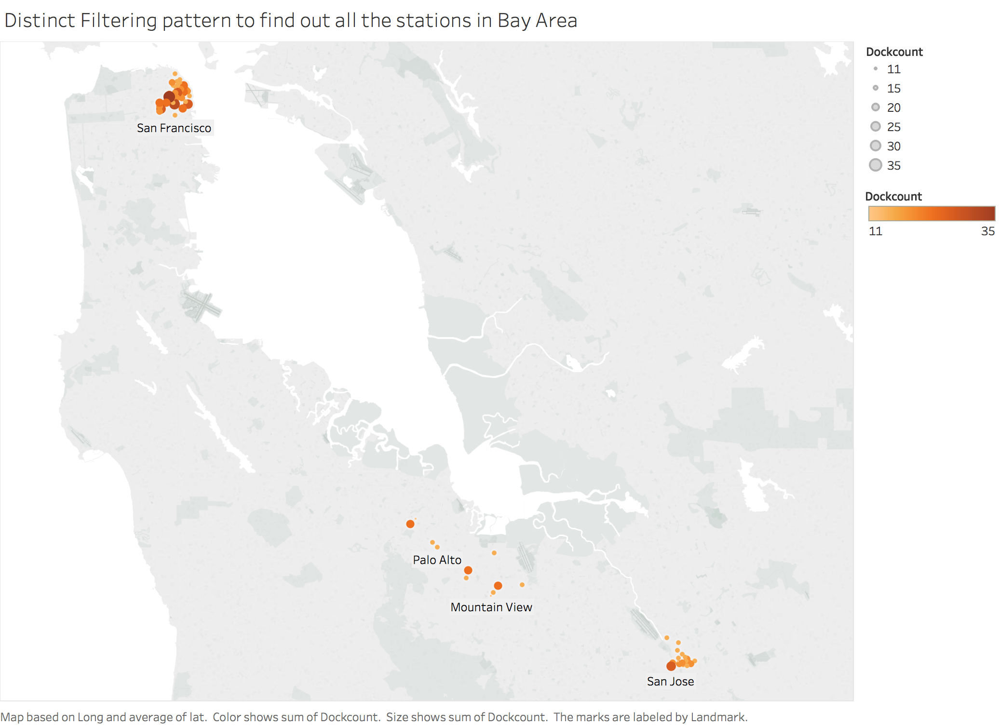

## Analysis 11: Analysis of trips based on start and end station

The following analysis determines the sum of all the rides between two stations. I used composite keys to determine these values.

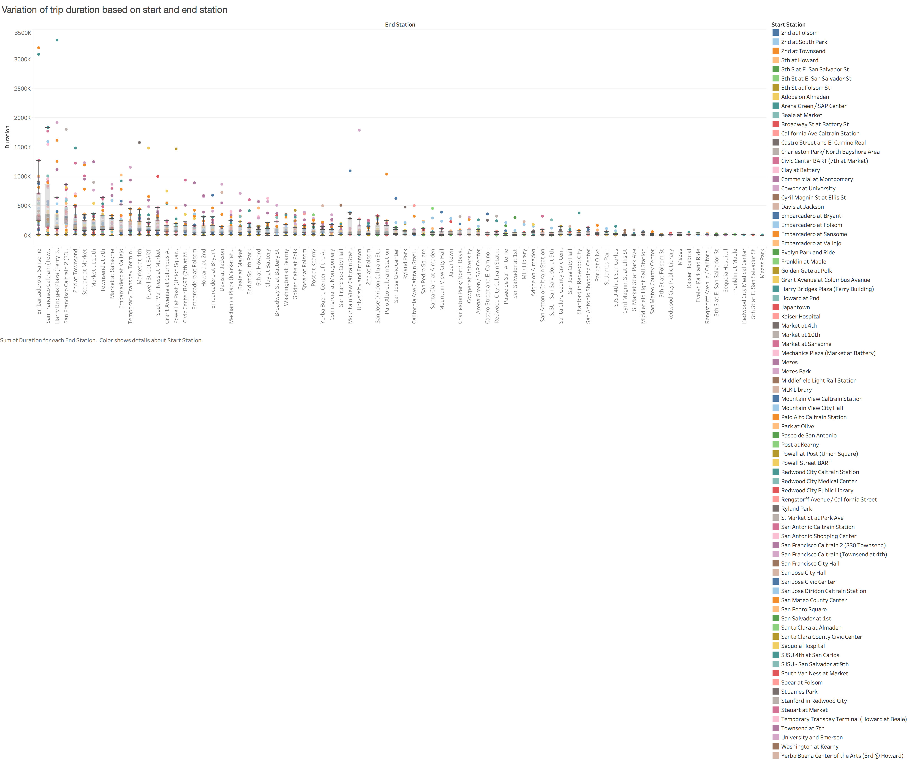
